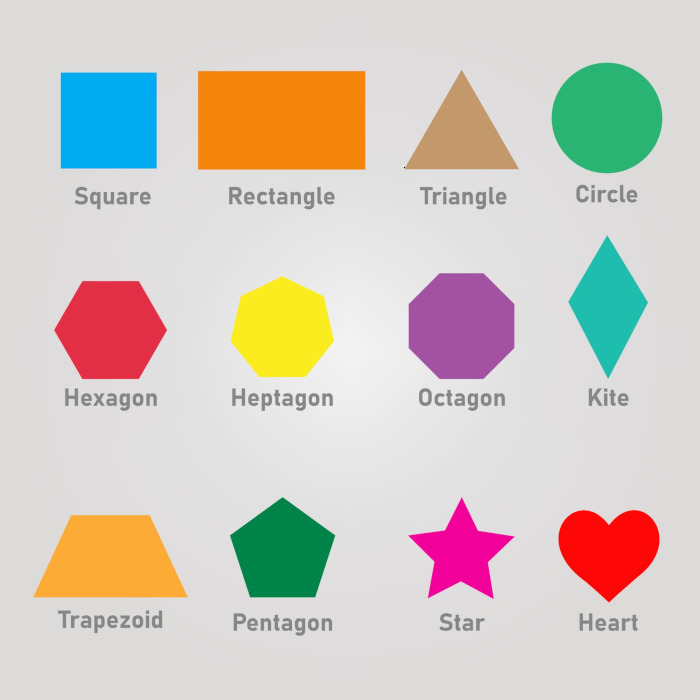

INSTALL GIT BASH
1. Run the command git --version
2. If there's an error, install Git Bash from https://git-scm.com/
3. Choose default options, but override the branch name with main.
4. Reload VS Code to apply changes.

INSTALL GITHUB CLI
1. Run the command gh --version
2. If there's an error, install GitHub CLI from https://cli.github.com/
3. Choose default options.
4. Reload VS Code to apply changes.

CONFIGURE USER NAME
1. `git init`  
2. Run the command `git config user. name.`
3. If it's not correct, run the command `git config user. name "myUserName".`
4. To set it as default, run the command. ` git config --global user.name "myUserName"`

CONFIGURE USER EMAIL
1. `git init`
2. Run the command `git config user.email.`
3. If it's not correct, run the command `git config user.email "my@email.com".`
4. To set it as default, run the command. ` git config --global user.email "my@email.com"`

COPY THE REPOSITORY LINK
1. Open GitHub.
2. Open the repository.
3. Click on the green Code button.
4. Copy the HTTPS link.

PULL FROM GITHUB
git init
git remote add origin https://github.com/myRepositoryLink
git pull origin main

DELETE UNUSED FILES
1. If there are files that VS Code doesn't need (like Glitch files), delete those.  

CREATE A NEW REPOSITORY IN GITHUB
 1. Click on the cat icon at the top left. 
 2. Click on the green new button at the top left. 
 3. Enter the repository name. 
 4. Click Create repository. 
 5. Do not change the default settings. 
 
PUSH TO GITHUB FOR THE FIRST TIME 
gh auth login \
git remote set-url origin https://github.com/superdud50/sandbox-level-2.git
git add . 
git commit -m "added files" 
git push --set-upstream origin main 

PUSH TO GITHUB REGULARLY 
git add . 
git commit -m "the changes I made" 
git push
        
COMMAND DESCRIPTIONS 
git init //Initializes source control git pull origin main //Copies files from the origin 
gh auth login //Grants authorization to push to your repository
git remote set-url origin //Sets the origin 
git push --set-upstream origin main //Pushes files to GitHub and makes origin and main the default options 

### RENAME DEFAULT BRANCH TO MAIN 
`git branch -M main`

### SET DEFAULT BRANCH TO MATN 
`git config --global init.defaultBranch main"`

(master) 
### DELETE SOURCE CONTROL
`ls -a` 
`rm -rf . git`
`r-f` recursive force

ls-a = List ALL files and folders
rm -rf.git = removes entire directory/folder (becomes hidden)

### CREATE A BRANCH
`git branch`
views the branches
`git branch whatToNameIt`

Switches to a branch
`git swtich`

`git merge`
Merges the branch

switch to the branch that you want to merge
`git switch main`

`git merge myBranch`
`.`
Curent Folder

`..` 
Previous Folder

`clear`
Clears the terminal

up arrow
Previous Comnmand

down arrow
Next command

tab
Autofills the command 

### Configure User Name

## MERGE TEST

1. `git init`
2. `git config user.name "superdud50"`
3. `git config user.email "keithfort225@gmail.com"`
4. `touch index.html`
5. `git add .`
6. `git commit -m "added files"`

### MERGE TEST
 `git init` //initializes an empty Git repository
 `touch index.html` //add index.html file
 `git add .`
 `git commit -m "added files"`
  GITHUB: Create a new repository called merge-test
 `git remote add origin https://myMergeTestRepository`
 `git push --set-upstream origin main`
 `git branch myBranch`
 `git switch myBranch`
 add `
Hello World!
` to the index.html file
 Save the changes CTRL + S
 `git add .`
 `git commit -m "updated file`
 `git switch main`
Change the history from `Auto` to `All`
 `git merge myBranch`
 `git push`
 `git switch myBranch`
 Add `
 Amazing World!
` to index.html file
 Save the changes CTRL + S
 `git add .`
 `git commit -m "updated file"`
 `git switch main`
 Add the file about.html with `touch about.html`
 `git add .`
 `git commit -m "added a file"`
 `git merge myBranch`
 Approve the merge by closing the merge editor or the VIM editor by typing `:qa` then `enter`
 `git rebase myBranch`
 `git push`
 `git switch myBranch`
 `git rebase main` //merged and rebased code
 Add `<h1>About Page</h1> to about.html
  Save the changes CTRL +S
 `git add .`
 `git commit -m "added heading"`
 `git switch main`
 Add `<h2>About Page</h2> to about.html
 Save the changes CTRL +S
`git add .`
`git commit -m "added heading"`
`git merge myBranch` //creates a conflict
 Select a resolution.
 Save the changes CTRL + S
 `git add .`
 `git commit -m "merged changes"`
 `git push` //fixed a merge conflict

 RESTORE A SAVE POINT
57. Select a commit to restore.
58. Copy its id.
59. `git reset --hard id123456789*`
60. `git push` will result in an error
61. `git push --force*`

PUSH A BRANCH TO GITHUB
`git push origin myBranch*`

DELETE A BRANCH
`git branch --delete myBranch*`
`git branch`

RESTORE A BRANCH
`git branch branch1 origin/myBranch`

Create a new file: image-map.html  
Download the shapes file: 2D-shapes.jpg from Week 2 Day 1 on CodeX Moodle Account
Save image as: 2d-shapes.jpg in SandBox Level 2 folder
Render it with image-map.html

Click Go Live at bottom of page
<map name="my-image-map"></map>
add the <map></map> element
 add the name attribute
add an empty string value
insert the value my-image-map

In the  tag, add the usemap attribute
 add an empty string value
insert the value #my-image-map

<area shape="rect">
add the self-closing <area> tag.
add the shape attribute with a blank string value
insert the value rect

<area coord="11,22,33,44">
add the attribute coords.
add a blank string value.
insert the coordinates of the bounding rectangle.

For shape="rect" use an image editor to find the coordinates:
 top left (x,y)
 bottom right (x,y)
    
************************************************
IMAGE EDITOR EXTENSIONS
VS Code Extension: Luna Paint - Image Editor (by Daniel Imms)
Alternative Glitch Tool: Pix Spy website  pixspy.com
************************************************
<area shape="circle">
add another self-closing <area> tag
add the shape attribute with a blank string value
insert the value circle.

<area coords="547,133 113">
add the attribute coords.
add a blank string value.
insert the coordinates of the bounding circle.
                                
PixSpy Directions
Upload an image
Hover over the shape
it will show the coordinates  
right click the center and drag a line to the edge to get the radius for a circle.
insert the measurement into the coordinates 

<area shape="poly"> (Polygon)
 add the self-closing <area> tag
 add the shape attribute with a blank string value.
insert the value "poly"

<area coords="610, 525, "> 
 add the attribute coords.
add the blank string value.
insert the coordinates of the bounding polygon.
for shape="poly" use an image editor to find the coords:
    coordinates of each corner (x,y)

Add a hyperlink and bookmark to each <area> tag.
href="https://shapes.com/circle"
href="#circles"

Resize the image by changing the width or height.
width="100%"
height="400px"
This expands the image to the full width of the page

JSDELIVR (Image Map Resizer)
 web search for "image map resizer CDN"
 choose the jsdelivr CDN
 link the file from the CDN 

### IMAGE MAP WITH ORDERED LIST
Use map and area to define an image map
map needs the name attribute
img needs the usemap attribute
usemap should start with # and match name

